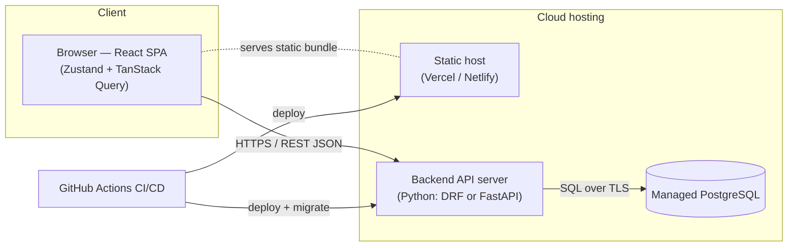
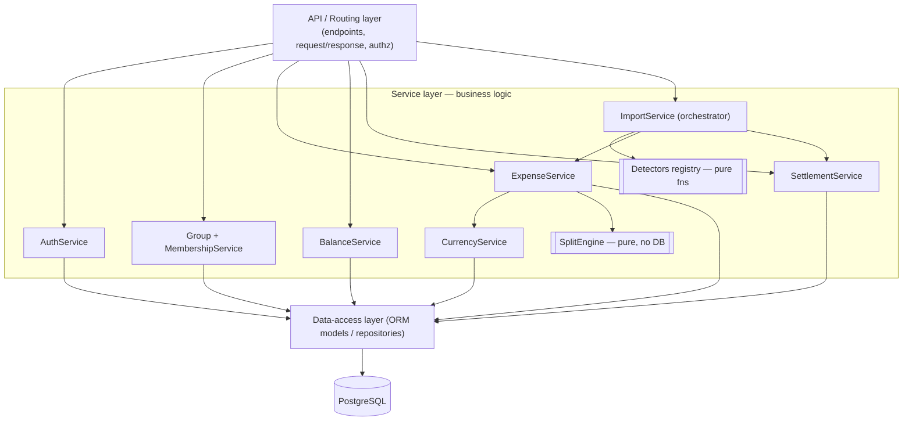
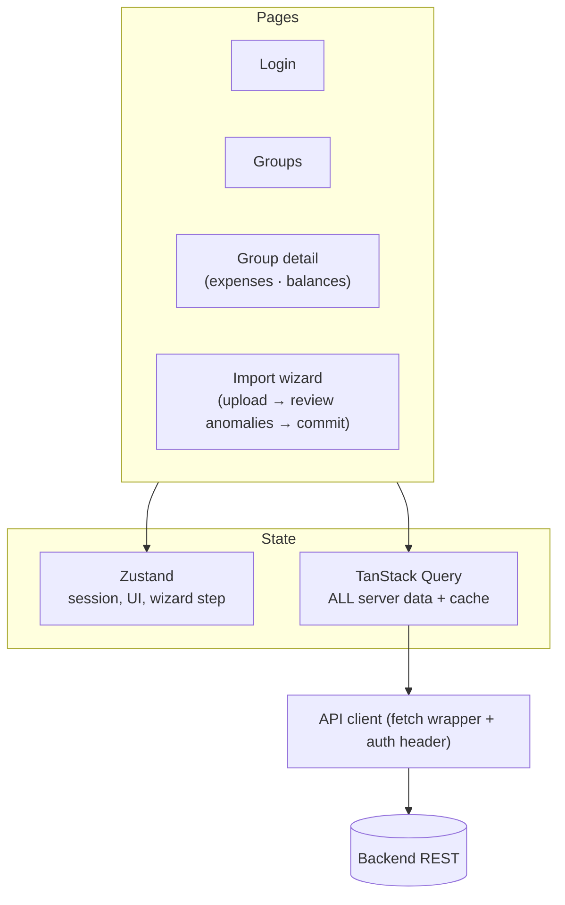

# HLD.md — High-Level Design

> How SPLITO's components connect. Diagrams are Mermaid (render on GitHub / VS Code preview).
> This is the last design layer where the backend framework is abstract; the next layer (LLD)
> needs the stack decision (DECISIONS.md D6) locked.

## Architectural style

A **modular monolith** — one backend app server, one database, one static frontend. No
microservices: for a small app with a single transactional core (expenses + their splits, and
the import commit), a monolith is simpler to deploy, keeps one transaction boundary, and is far
easier to demo and reason about. No external FX API — exchange rates are **seeded** into the
`fx_rate` table (see DECISIONS.md D4).

---

## 1. Deployment topology



Three deployables: static frontend, one backend app server, one managed Postgres.

---

## 2. Backend internal architecture (layered)



**Key connections**
- **`SplitEngine` and `CurrencyService` are shared** by both `ExpenseService` (normal write) and
  `ImportService` (on commit). One engine, two callers — the importer is a deferred, human-gated
  version of the create flow.
- **`Detectors` is a registry of pure functions** (one per anomaly type). `ImportService` loops the
  registry over staged rows. Each detector is isolated and testable — you can point at exactly one
  function per anomaly in a live review.
- **`BalanceService`** reads the `person_balance` view, then runs greedy min-cash-flow for the
  simplified "who pays whom" view.

---

## 3. Module → responsibility → tables owned

| Module | Responsibility | Owns / writes |
|---|---|---|
| AuthService | register, login, session/JWT | `app_user` |
| Group + MembershipService | groups, add/remove people, join/leave dates | `expense_group`, `person`, `person_alias`, `membership` |
| ExpenseService | create/edit/void expense, orchestrate split | `expense`, `expense_share` |
| **SplitEngine** | pure: (amount, type, participants) → integer-paise shares | *(none — pure)* |
| CurrencyService | convert to base INR, snapshot rate onto expense | reads `fx_rate` |
| SettlementService | record payments/transfers | `settlement` |
| BalanceService | net balances + debt simplification | reads `person_balance` view |
| **ImportService** | orchestrate parse → stage → detect → commit | `import_batch`, `staged_row` |
| **Detectors** | pure: staged rows → anomalies | `anomaly` |

---

## 4. Frontend architecture — server-state vs UI-state split



**Rule:** if it lives in the DB, it's TanStack Query (cache + auto-refetch on mutation); if it dies
on refresh, it's Zustand (who's logged in, current wizard step, open modal). The import wizard is the
one multi-step stateful flow: Zustand tracks the step, TanStack Query holds the anomaly list and
drives the commit mutation.

---

## 5. Cross-cutting concerns

| Concern | Approach |
|---|---|
| **AuthN / AuthZ** | Token (JWT) or session; every `/groups/**` route verifies the user belongs to the group |
| **Atomicity** | Expense + its shares, and the import-commit, each wrap in **one DB transaction** — never a half-written split |
| **Validation** | 3 layers: frontend soft (UX) → API hard (trust boundary) → DB constraints (final net) |
| **Errors** | Structured JSON `{code, message, field}` so the frontend can show field-level messages |
| **Audit / provenance** | `import_batch_id` + `source_row_number` on every imported ledger row; `reviewed_by` on anomalies |
| **Config / secrets** | DB URL, secret key, FX seed in env vars (`.env`, gitignored) |

---

## 6. API surface (grouped)

```
Auth      POST /auth/register · POST /auth/login
Groups    GET/POST /groups · POST /groups/:id/members · PATCH /members/:id (join/leave)
Expenses  GET/POST /groups/:id/expenses · PATCH/DELETE /expenses/:id
Balances  GET /groups/:id/balances · GET /groups/:id/balances/simplified · GET /people/:id/ledger
Settle    POST /groups/:id/settlements
Import    POST /groups/:id/import · GET /import/:batch/report ·
          POST /import/:batch/anomalies/:id/resolve · POST /import/:batch/commit
```

---

## 7. Where the stack decision (D6) bites

This HLD holds for **either** backend framework. The difference is only in the DAL + validation
layer:

- **Django + DRF:** ORM models + migrations, DRF serializers = validation, and the built-in **admin
  gives a free UI to inspect the quarantine tables live** — a real demo advantage for the import.
- **FastAPI:** SQLAlchemy models + Alembic migrations, Pydantic = validation, no built-in admin.

The next layer (LLD — module signatures, ORM models, endpoint contracts) requires D6 locked.
